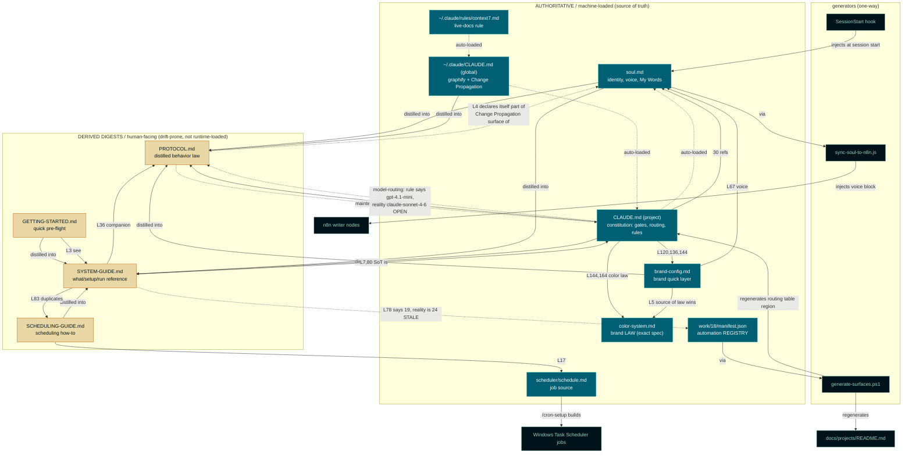

# Alex Personal OS — Core Architecture Analysis

**Date:** 2026-07-08
**Scope:** The core architecture files at the personal-os root + their declared authorities.
**Method:** Parsed actual file content only. Cross-references cite exact line numbers. No inference.
**Context:** Refactoring Alex's architecture to eliminate structural issues while preserving logic and mindset encoding.

**Files analyzed (9):** `soul.md`, `CLAUDE.md` (project), `~/.claude/CLAUDE.md` (global) + `~/.claude/rules/context7.md`, `PROTOCOL.md`, `SYSTEM-GUIDE.md`, `GETTING-STARTED.md`, `SCHEDULING-GUIDE.md`, `brand/config/brand-config.md`, `brand/config/color-system.md` (added because `brand-config.md:5` declares it the "source of law").

---

## Headline finding

The files split into two classes the system does not treat as different, but should:

1. **Authoritative and machine-loaded** — `soul.md` (via SessionStart hook), `CLAUDE.md` project + global (auto-loaded), the brand files (read on the gate), `manifest.json` (routing source).
2. **Derived human-facing digests that drift with zero enforcement** — `PROTOCOL.md`, `SYSTEM-GUIDE.md`, `GETTING-STARTED.md`, `SCHEDULING-GUIDE.md`.

Proof it's unenforced: `CLAUDE.md` references `soul.md` 30 times and the brand files 4 times, but **never once names PROTOCOL.md, SYSTEM-GUIDE.md, GETTING-STARTED.md, or SCHEDULING-GUIDE.md** (grep-confirmed). The digests point *up* at the constitution; the constitution never points *down*. So they can rot and nothing catches it. One already has: `SYSTEM-GUIDE.md:78` says "19 numbered automations," the routing table runs to **24**.

---

## 1. Mermaid: dependency, hierarchy, data flow



---

## 2. Structured JSON (per file, actual content only)

```json
{
  "analysis_date": "2026-07-08",
  "root": "C:/Users/Thinkpad/Desktop/personal-os",
  "files": [
    {
      "file": "soul.md",
      "purpose": "Identity, personality, voice, and the live 'My Words' phrasing corpus. The file the agent becomes.",
      "scope": "WHO Alex is. Identity + voice only. No operational procedure.",
      "key_sections": ["My Role", "Agent Personality - Alex (L24-35)", "Voice Rules (L37-40)", "Detection-proofing (L43-53)", "My Words live corpus (L58-258)"],
      "dependencies_on_other_files": ["vault/sources/notes/alex-linkedin-series-concept.md (L74, read-only source)"],
      "referenced_by": ["CLAUDE.md (30x)", "PROTOCOL.md (L14-16)", "SYSTEM-GUIDE.md (L29-32)", "brand-config.md (L67)", "sync-soul-to-n8n.js"],
      "ownership_domain": "Identity / voice / personality / My Words corpus",
      "layer": "AUTHORITATIVE (machine-loaded via SessionStart hook)"
    },
    {
      "file": "CLAUDE.md (project)",
      "purpose": "The operating constitution: standing orders, the three gates, routing table, MCP reference, model routing, rules.",
      "scope": "HOW Alex works. The behavior config the agent actually auto-loads.",
      "key_sections": ["Who You Are", "Vault Protocol", "Brand + Soul Pre-Flight Gate (L~114)", "Brand Protocol (L136,144,164)", "MCP Reference", "Model Routing", "Routing Table (generated)", "Close-Out Gate", "Change Propagation"],
      "dependencies_on_other_files": ["soul.md (30 refs)", "brand/config/brand-config.md (L120,136,144)", "brand/config/color-system.md (L144,164)", "work/18-recovery-layer/manifest.json (routing source)", "scripts/generate-surfaces.ps1", "scripts/sync-soul-to-n8n.js", "vault/identity.md", "work/{n}/CLAUDE.md"],
      "referenced_by": ["PROTOCOL.md (L3-5)", "SYSTEM-GUIDE.md (L7,30,80)", "GETTING-STARTED.md (L52, via work/{n})"],
      "ownership_domain": "Operating constitution / gates / rules / MCP config",
      "layer": "AUTHORITATIVE (auto-loaded); routing-table region is a GENERATED view of manifest.json"
    },
    {
      "file": "~/.claude/CLAUDE.md (global)",
      "purpose": "Cross-project standing orders: graphify skill pointer + the Change Propagation standing order.",
      "scope": "Machine-wide, all projects. Thin.",
      "key_sections": ["graphify (L1-3)", "Change Propagation STANDING ORDER (L5-6)"],
      "dependencies_on_other_files": ["~/.claude/skills/graphify/SKILL.md (L2)", "~/.claude/rules/context7.md (sibling, co-loaded)"],
      "referenced_by": ["PROTOCOL.md (L3, L93)", "SYSTEM-GUIDE.md (L34-35)", "project CLAUDE.md (re-states Change Propagation)"],
      "ownership_domain": "Cross-project standing orders",
      "layer": "AUTHORITATIVE (auto-loaded)"
    },
    {
      "file": "brand/config/color-system.md",
      "purpose": "The exact brand specification: 10-color palette, hexes, RGB/CMYK/HSL, usage rules, contrast pairings, do/don't, design tokens.",
      "scope": "Brand color LAW. The spec, not inspiration (L5).",
      "key_sections": ["The Palette (L23-37)", "60-30-10 hierarchy (L40-49)", "Exact Usage Rules (L52-103)", "Design Tokens CSS/JSON (L142-209)"],
      "dependencies_on_other_files": [],
      "referenced_by": ["brand-config.md (L5, source of law)", "CLAUDE.md (L144,164)", "PROTOCOL.md (L52,177)"],
      "ownership_domain": "Brand color law (SOURCE OF TRUTH for all color)",
      "layer": "AUTHORITATIVE (read on Brand Pre-Flight Gate)"
    },
    {
      "file": "brand/config/brand-config.md",
      "purpose": "Operational quick layer over the color law: colors, fonts, logo rules, Excel/PDF/chart/deck formatting, tone.",
      "scope": "Brand application. Explicitly subordinate to color-system.md (L5).",
      "key_sections": ["Colors (L7-17)", "Fonts (L19-28)", "Logo (L30-35)", "Charts (L37-41)", "Presentations (L43-48)", "Excel (L50-57)", "Tone (L66-67)"],
      "dependencies_on_other_files": ["brand/config/color-system.md (L5, 'the Brand File wins')", "soul.md (L67, voice)", "work/12-linkedin-series/screenshots/DIAGRAM-DESIGN-SYSTEM.md (L46)"],
      "referenced_by": ["CLAUDE.md (L120,136,144,164)", "PROTOCOL.md (L52,177)"],
      "ownership_domain": "Brand application / operational quick layer",
      "layer": "AUTHORITATIVE (read first on the gate; defers to color-system.md on conflict)"
    },
    {
      "file": "PROTOCOL.md",
      "purpose": "The distilled, deduplicated operating law in second person. A digest of soul.md + CLAUDE.md + brand files.",
      "scope": "Behavior law summary. Explicitly NOT authoritative (L5: 'soul.md and CLAUDE.md remain the authoritative sources').",
      "key_sections": ["Who you are (L13)", "Voice (L26)", "The three gates (L45-102)", "Vault (L104)", "People/Activity (L118)", "Tooling+routing (L134)", "Non-negotiables (L185)"],
      "dependencies_on_other_files": ["soul.md (L3,14)", "CLAUDE.md project+global (L3)", "brand-config.md (L52,177)", "color-system.md (L52)", "manifest.json (L97)", "generate-surfaces.ps1 (L98)", "sync-soul-to-n8n.js (L71,154)", "DIAGRAM-DESIGN-SYSTEM.md (L175)", "decisions.md (L197)"],
      "referenced_by": ["SYSTEM-GUIDE.md (L6,36)"],
      "ownership_domain": "Distilled behavior law (DERIVED digest)",
      "layer": "DERIVED (not auto-loaded; declares itself part of the Change Propagation surface of its sources, L4)"
    },
    {
      "file": "SYSTEM-GUIDE.md",
      "purpose": "The single human-readable reference: what Alex is, requirements, install, automations, MCP, scheduling, backup, how it stays current.",
      "scope": "Human onboarding + operations reference. Distilled 2026-07-05 (L4-6).",
      "key_sections": ["What Alex is (L12)", "The two brain files (L29)", "Install (L48)", "The automations (L77)", "MCP (L96)", "Scheduling (L114)", "Backup (L134)"],
      "dependencies_on_other_files": ["GETTING-STARTED.md (L5)", "SCHEDULING-GUIDE.md (L5)", "soul.md (L5,30)", "CLAUDE.md (L7,30,80)", "PROTOCOL.md (L6,36)", "vault/identity.md (L37,151)", "identity files installing-alex/alex-explained (L5)"],
      "referenced_by": ["GETTING-STARTED.md (L3)"],
      "ownership_domain": "Human 'what/setup/run/where' reference (DERIVED)",
      "layer": "DERIVED (not auto-loaded; STALE: L78 '19 automations' vs actual 24)"
    },
    {
      "file": "GETTING-STARTED.md",
      "purpose": "Quick 5-10 minute pre-flight: prereqs + connectors before /setup.",
      "scope": "Narrow subset of SYSTEM-GUIDE, the very first steps only.",
      "key_sections": ["Install Prerequisites (L5)", "Connect Your Tools (L14)", "Run /setup (L25)", "Dispatch (L44)"],
      "dependencies_on_other_files": ["SYSTEM-GUIDE.md (L3)", "work/{n}-{name}/CLAUDE.md (L52)"],
      "referenced_by": ["SYSTEM-GUIDE.md (L5)"],
      "ownership_domain": "Quick-start pre-flight (DERIVED subset of SYSTEM-GUIDE)",
      "layer": "DERIVED (not auto-loaded)"
    },
    {
      "file": "SCHEDULING-GUIDE.md",
      "purpose": "How to schedule Claude Code to run automatically: Task Scheduler / cron, hardened .ps1 wrappers, management.",
      "scope": "Scheduling how-to. Overlaps SYSTEM-GUIDE section 8 heavily.",
      "key_sections": ["What This Does (L3)", "Setup (L15)", "Hardened jobs (L37)", "Key Rules (L46)", "Management (L55)"],
      "dependencies_on_other_files": ["scheduler/schedule.md (L17, job source)", "/cron-setup"],
      "referenced_by": ["SYSTEM-GUIDE.md (L5, distilled from)"],
      "ownership_domain": "Scheduling how-to (DERIVED; job source of truth is scheduler/schedule.md)",
      "layer": "DERIVED (not auto-loaded)"
    }
  ]
}
```

---

## 3. Boundaries analysis

### Source of truth per domain

| Domain | Source of truth | Derived / duplicate copies that must follow it |
|---|---|---|
| Identity, voice, personality | `soul.md` | `CLAUDE.md` "Who You Are", `PROTOCOL.md` s0-1, `brand-config.md` Tone (L67) |
| My Words corpus | `soul.md` "My Words" | n8n writer nodes (via `sync-soul-to-n8n.js`) |
| Operating rules / gates / MCP | `CLAUDE.md` (project) | `PROTOCOL.md` (digest), `SYSTEM-GUIDE.md` (human summary) |
| Cross-project standing orders | `~/.claude/CLAUDE.md` | `CLAUDE.md` re-states Change Propagation, `PROTOCOL.md` s2c |
| Automation registry / routing | `work/18/manifest.json` | `CLAUDE.md` routing table (generated view), `docs/projects/README.md`, `SYSTEM-GUIDE.md` s6 |
| Brand color | `color-system.md` | `brand-config.md`, `CLAUDE.md` brand protocol, `PROTOCOL.md` s6 |
| Scheduled jobs | `scheduler/schedule.md` | `SCHEDULING-GUIDE.md`, `SYSTEM-GUIDE.md` s8 |
| Live-docs rule | `~/.claude/rules/context7.md` | `PROTOCOL.md` s5, `CLAUDE.md` MCP ref, `SYSTEM-GUIDE.md` s7 |
| Human setup reference | `SYSTEM-GUIDE.md` | `GETTING-STARTED.md` (subset) |

### Overlap / redundancy (ranked by drift risk)

1. **Change Propagation is triplicated.** Full standing order in `~/.claude/CLAUDE.md:5-6`, project `CLAUDE.md` ("Change Propagation & Session Close-Out"), and `PROTOCOL.md:91-102` s2c. Three hand-maintained copies of the same order. Highest-frequency drift surface.
2. **Scheduling is written twice in full.** `SCHEDULING-GUIDE.md` and `SYSTEM-GUIDE.md:114-132` s8 cover the same ground. `SYSTEM-GUIDE.md:83` even admits the duplication.
3. **MCP reference appears four times.** `CLAUDE.md` MCP Reference, `PROTOCOL.md` s5, `SYSTEM-GUIDE.md` s7, and the context7 slice in `rules/context7.md`.
4. **Brand palette restated three times.** `color-system.md` (law) -> `brand-config.md` (quick layer) -> `CLAUDE.md:144` (inline hexes). The hexes are physically retyped in `CLAUDE.md`, so a palette change means editing three files.
5. **PROTOCOL.md and SYSTEM-GUIDE.md are both full-system digests** distilled the same day (2026-07-05), split only by "behaves" vs "is/run." Neither carries unique truth, only a snapshot that ages.

### Unclear responsibilities

- **PROTOCOL.md calls itself "The single operating law for Alex" (L1) but is not the file the agent loads.** The agent loads `soul.md` + `CLAUDE.md`. So the "law" and the loaded config can silently disagree, and the "law" loses (L5 concedes it). Authoritative-sounding title, derived-in-fact status.
- **Routing table lives inside `CLAUDE.md` but is owned by `manifest.json`.** An authoritative file contains a generated region. Hand-editing between the markers corrupts the relationship. `CLAUDE.md` is both a source of truth (rules) and a generated artifact (routing).
- **`brand-config.md` vs `color-system.md`:** "quick layer" vs "law" is stated (L5), but both are read on the gate and both carry usage rules (e.g. chart series order is defined in both: `brand-config.md:38`, `color-system.md:93`), so which one an operator edits is not obvious.

### Contradictions flagged (hard, with lines)

- **Automation count.** `SYSTEM-GUIDE.md:78,85` "19 numbered automations... Plus #19 venture-sync." Reality per the `CLAUDE.md` routing table and `git status` (new `work/24-flight-search/`) is **24** plus voice + cost tracker. SYSTEM-GUIDE is stale despite `PROTOCOL.md:7-9` claiming a 2026-07-08 drift-sync, so the sync did not reach SYSTEM-GUIDE.
- **Retired automation still listed.** `SYSTEM-GUIDE.md:83,89` lists "content" / "content machine" as an out-of-the-box automation; the `CLAUDE.md` routing table marks #09 **RETIRED 2026-07-06**.
- **Model routing rule vs reality (self-documented, OPEN).** `CLAUDE.md` model-routing section and `PROTOCOL.md:148-153` both state "prose to OpenAI gpt-4.1-mini," and both then admit the live `Build Writer Request` runs `claude-sonnet-4-6`. The rule contradicts the deployment; both files flag it unresolved.

### Circular dependencies

No true read-time cycles. `soul.md` is a clean leaf (reads only a vault source). The one loop is *maintenance-only*: `PROTOCOL.md:4` declares itself part of the Change Propagation surface of `soul.md` + `CLAUDE.md`, so editing a source obligates editing the digest, which obligates re-checking the source. A human upkeep loop, not a dependency cycle, and it is exactly where the staleness above leaks in.

---

## 4. Connections map (how information flows)

```
SESSION BOOT
  SessionStart hook --inject--> soul.md --> agent adopts identity/voice
  Claude Code --auto-load--> CLAUDE.md (project) --chains--> ~/.claude/CLAUDE.md (global) + rules/context7.md

RUNTIME (identity-carrying output)
  Brand Pre-Flight Gate --read--> brand-config.md --defers on conflict--> color-system.md (LAW)
  Voice output --re-read--> soul.md "My Words" --> draft

GENERATION (one-way, source > view)
  manifest.json --generate-surfaces.ps1--> CLAUDE.md routing region + docs/projects/README.md
  soul.md --sync-soul-to-n8n.js--> n8n writer nodes (voice block between <<<SOUL_VOICE>>> markers)
  scheduler/schedule.md --/cron-setup--> Windows Task Scheduler jobs

DISTILLATION (one-way, authoritative > human digest; the drift frontier)
  soul.md + CLAUDE.md + brand files --distill--> PROTOCOL.md   (behavior law digest)
  GETTING-STARTED + SCHEDULING-GUIDE + soul.md + CLAUDE.md --distill--> SYSTEM-GUIDE.md
  SYSTEM-GUIDE.md --points readers to--> CLAUDE.md routing table (as SoT) + PROTOCOL.md (companion)
  GETTING-STARTED.md --points to--> SYSTEM-GUIDE.md (for the full picture)

FEEDBACK / UPKEEP (the loop that leaks)
  any real change --Change Propagation--> must touch: runbook + work/{n}/CLAUDE.md + root & global CLAUDE.md
                                          + status.md + index.md + log.md + identity.md + docs/ + PROTOCOL.md + SYSTEM-GUIDE.md
  ^ this is hand-walked; the digests (PROTOCOL, SYSTEM-GUIDE) are the tail end and get missed (see: 19 vs 24)
```

---

## Takeaway for the refactor

The machine-loaded spine (`soul.md`, `CLAUDE.md`, the brand law, the generated registry) is clean and single-owner. The structural rot is entirely in the *derived digest layer* and the *manually-mirrored standing orders*. Two moves fix most of it:

1. **Generate the digests instead of hand-maintaining them.** Treat `PROTOCOL.md` / `SYSTEM-GUIDE.md` / the scheduling+MCP+brand restatements the way the routing table is already treated: generated from the authoritative files so they cannot drift.
2. **Collapse Change Propagation to one owned copy** (global `CLAUDE.md`) that the others link to rather than restate.

Both preserve every bit of the logic and mindset encoding while killing the surfaces that go stale.
